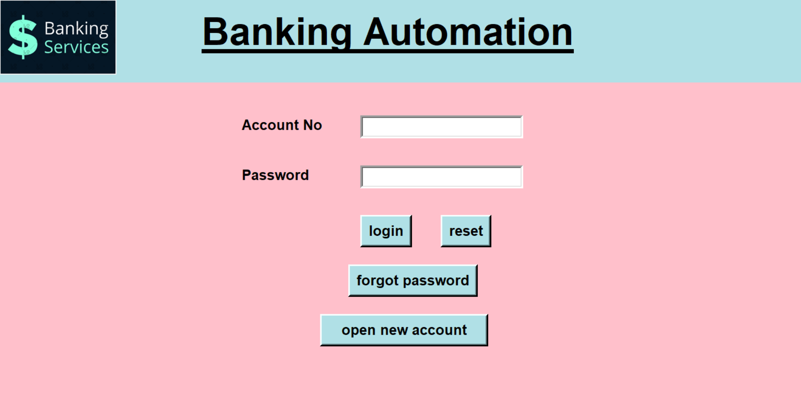

# Bank Automation



Banking Automation is a desktop application in which you can create account and manage transanctions.

## Tech Used:

- Python with Tkinter

- SQLite.

## Usage:

Install pillow

```
$ pip install pillow
```
